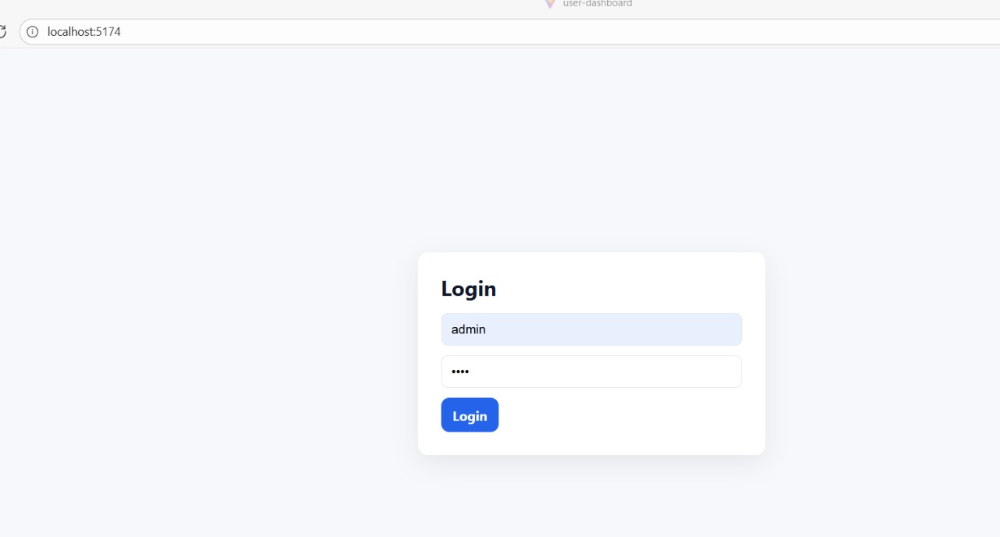

## User Management Dashboard

A modern, responsive frontend application built with React (Vite) for managing users.
Features role-based filtering, search, and a simple login interface. Ideal for demonstrating frontend development, React hooks, and component-driven design.

## Live Demo: User Management Dashboard

## Setup Steps

1️.Clone the repository

git clone https://github.com/pavithradev23/2.git
cd 2

2️.Install dependencies

npm install

3️.Run the app locally

npm run dev

Then open: http://localhost:5173

4️. Build for production (optional)

npm run build

## Tech Stack
Category	Technology
Frontend Framework	React (Vite)
Styling	CSS
Charts/Visualization	Recharts
Language	JavaScript (ES6+)
Build Tool	Vite
Hosting	Netlify

###  Screenshots

**Login Page**  
  

**Dashboard View**  
  

**Search & Filter**  

## Mock Data

The app uses static mock data located at:

src/data/users.json

💡 Assumptions & Bonus Features

##Assumptions:

All user data is stored locally (mock JSON).

Roles include Admin, Manager, Employee, etc.

Login is mocked for demo purposes.

##Bonus Features Implemented:

Responsive layout for mobile and desktop.

Role-based filtering and search functionality.

Simple authentication (mock login).

Clean and modular React component structure.

Alternatively, open the Netlify demo with auto-login:
https://lustrous-llama-2d5045.netlify.app?demo=true

## Deployment

This project is deployed on Netlify:
Live Demo

## Author

Pavithra
Frontend Developer | Passionate about UI/UX, React, and Web Technologies
https://github.com/pavithradev23/User-Dashboard